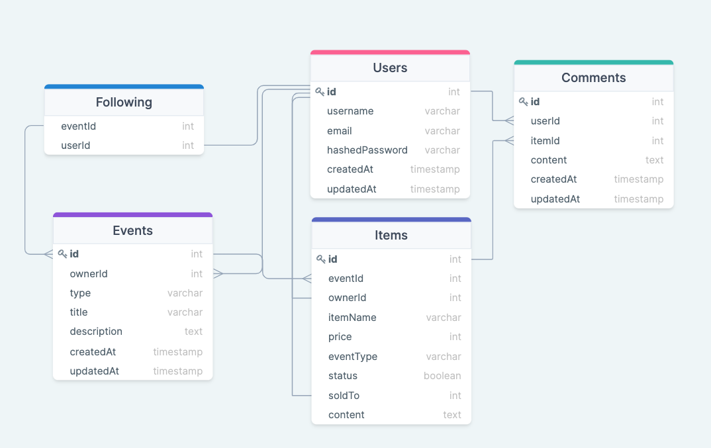

# Purge, a website for hobbyist and collectors to buy, sell, and trade a different way.

## MVPs 
1. User's profile, CRUD
2. Hub Central, a page where all the feed is presented, create a Purge event (CRUD)
3. User-Buyer(s)/Seller(s) can follow a purge event
4. User-Seller can post item for sale, with options (Purge, Offer, Trade), select one or more
5. User-Buyer can claim item being purged, and select (Purge, Offer, Trade), select only one. 
6. User-Seller can relist item during purge event if it does not sell, at a lower increment set by seller. 

### Strech Goals
1. User-Seller can star Auction event
2. User-Buyer(s) can bid on item
3. User-Seller/Buyer reach a deal, a contract page is created, to set terms

---
## Database Design

---

## Wireframes
Need finish, to be submitted

## Routes
---
### Backend
---
### User
| Route                          | Methods                 | Purpose |
| ------------------------------ | ------------------------| ------- |
| /api/register                  | POST                    | User account creation |
| /api/user/:id                  | GET, PUT, DELETE        | Get, edit, or delete User account information |
| /api/user/:id/comments         | GET, PUT, DELETE        | Get, edit, or delete comments associated with the User |
| /api/user/:id/following        | GET, PUT, DELETE        | Get, edit, delete followings associated with the User |

### Event

| Route                                | Methods                 | Purpose |
| -----------------------------------  | ------------------------| ------- |
| /api/event/create                    | POST                    | creating event|
| /api/event/:eventId                  | GET, PUT, DELETE        | event retrieval. edit / delete if owner |
| /api/event/:eventId                  | GET, POST, PUT, DELETE  | CRUD event|
| /api/event/:eventId/follow/          | GET, POST               | follow and unfollow |
| /api/event/:eventId/item/:itemId     | GET, PUT, DELETE        | Get, edit, or delete items associated with the Event |

---
### Frontend
---
| Route                                | Methods                 | Purpose |
| -----------------------------------  | ------------------------| ------- |
| /                                    | GET                     | display hub, show all events |
| /login                               | POST                    | Login Functionality |
| /register                            | POST                    | User creation form |
| /event/:eventId                      | GET                     | Expand to view event page |
| /event/create                        | GET, POST               | Expand form for creating a item |
| /user/:userId/comments               | GET                     | User comments |
